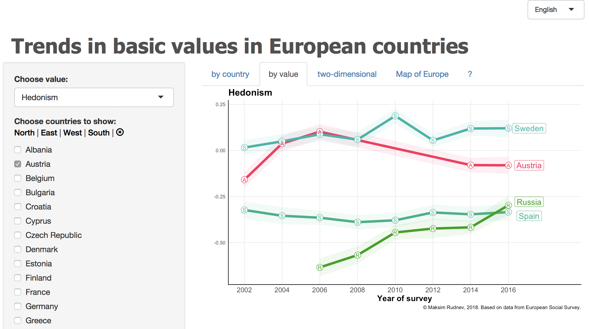

# Basic values in Europe

A Shiny App that demontrates means of basic values measured with Schwartz (2001) scale in European Social Survey.

To run, type in the RStudio console: `shiny::runGitHub("ShinyValues", "maksimrudnev")`

The tool is purely exploratory, don’t forget about comparability and measurement invariance problems. 

Demo is published here: https://rudnev.shinyapps.io/Basic_Values/

There are three tabs to explore trends by country, which allows comparison of value trends within each country, by value – to compare countries, and value map to see all the countries as points in the space of two higher order value dimensions. Point you mouse at country point on the value map to see how they moved during the measurement period.

